# 🚀 SocialOSINTLM

**SocialOSINTLM** is a powerful Python-based tool designed for Open Source Intelligence (OSINT) gathering and analysis. It aggregates and analyzes user activity across multiple social media platforms, including **Twitter / X, Reddit, Hacker News (via Algolia), Mastodon (multi-instance), and Bluesky**. Leveraging AI through OpenAI-compatible APIs (e.g., OpenRouter, OpenAI, self-hosted models), it provides comprehensive insights into user engagement, content themes, behavioral patterns, and media content analysis.

## 🌟 Key Features

✅ **Multi-Platform Data Collection:** Aggregates data from Twitter/X, Reddit, Bluesky, Hacker News (via Algolia API), and Mastodon (multi-instance support, with federated user lookup if a default instance is configured).

✅ **AI-Powered Analysis:** Utilises configurable models via OpenAI-compatible APIs for sophisticated text and image analysis.

✅ **Structured AI Prompts:** Employs detailed system prompts for objective, evidence-based analysis focusing on behavior, semantics, interests, and communication style.

✅ **Vision-Capable Image Analysis:** Analyzes downloaded images (`JPEG, PNG, GIF, WEBP`) for OSINT insights using a vision-enabled LLM, focusing on objective details (setting, objects, people, text, activity). Images are pre-processed (e.g., resized to a max dimension like 1536px, first frame of GIFs).

✅ **Efficient Media Handling:** Downloads media, stores it locally, handles platform-specific authentication (e.g., Twitter Bearer, Bluesky JWT for CDN), processes Reddit galleries, and resizes large images for analysis.

✅ **Cross-Account Comparison:** Analyze profiles across multiple selected platforms simultaneously.

✅ **Intelligent Rate Limit Handling:** Detects API rate limits (especially detailed for Twitter, Mastodon, & LLM APIs, showing reset times), provides informative feedback, and prevents excessive requests. Raises `RateLimitExceededError`.

✅ **Robust Caching System:** Caches fetched data for 24 hours (`data/cache/`) to reduce API calls and speed up subsequent analyses. Media files are cached in `data/media/`.

✅ **Offline Mode (`--offline`):** Run analysis using only locally cached data, ignores cache expiry, skipping all external network requests (social platforms, media downloads, *new* vision analysis).

✅ **Interactive CLI:** User-friendly command-line interface with rich formatting (`rich`) for platform selection, user input, and displaying results.

✅ **Programmatic/Batch Mode:** Supports input via JSON from stdin for automated workflows (`--stdin`).

✅ **Configurable Fetch Limits:** Fetches a defined number of recent items per platform (e.g., 50 for Twitter/Reddit/HN initial/incremental, 40 for Mastodon API limit) to balance depth and API usage.

✅ **Detailed Logging:** Logs errors and operational details to `analyzer.log`.

✅ **Environment Variable Configuration:** Easy setup using environment variables or a `.env` file, and a JSON file for Mastodon instances.

✅ **Data Purging:** Interactive option to purge cached text/metadata, media files, or output reports.

```mermaid
flowchart TD
    %% Initialization
    A([Start SocialOSINTLM]) --> AA{{Setup Directories & API Clients<br/>Verify Environment}}
    
    %% Mode Selection
    AA --> B{Interactive or<br/>Stdin Mode?}
    
    %% Interactive Mode Path
    B -->|Interactive| B1([Prompt Auto-Save Setting])
    B1 --> C[/Display Platform Menu/]
    C --> D{Platform<br/>Selection}
    
    %% Platform-Specific Branches
    D -->|Twitter| E1([Twitter])
    D -->|Reddit| E2([Reddit])
    D -->|HackerNews| E3([HackerNews])
    D -->|Bluesky| E4([Bluesky])
    D -->|Mastodon| E5([Mastodon])
    D -->|Cross-Platform| E6([Multiple Platforms])
    D -->|Purge Data| PD([Purge Data])
    PD --> C
    
    %% Stdin Mode Path
    B -->|Stdin| F([Parse JSON Input])
    F --> GA([Get Auto-Save Setting])
    GA --> G([Extract Platforms & Query])
    
    %% Analysis Loop Entry Points
    E1 --> H([Enter Analysis Loop])
    E2 --> H
    E3 --> H
    E4 --> H
    E5 --> H
    E6 --> H
    G --> J([Run Analysis])
    
    %% Command Processing in Analysis Loop
    H -->|Query Input| I{Command<br/>Type}
    I -->|Analysis Query| J
    I -->|exit| Z([End Session])
    I -->|refresh| Y([Force Refresh Cache])
    Y --> H
    
    %% Data Fetching and Caching
    J --> K{Cache<br/>Available?}
    K -->|Yes| M([Load Cached Data])
    K -->|No| L([Fetch Platform Data])
    
    %% API & Rate Limit Handling
    L --> L1{Rate<br/>Limited?}
    L1 -->|Yes| L2([Handle Rate Limit])
    L2 --> L5([Abort or Retry])
    L1 -->|No| L3([Extract Text & URLs])
    L3 --> L4([Save to Cache])
    
    L4 --> M
    
    %% Parallel Processing Paths
    M --> N([Process Text Data])
    M --> O([Process Media Data])
    
    %% Media Analysis Pipeline
    O --> P([Download Media Files])
    P --> PA{File Exists}
    PA -->|Yes| Q1([Load existing cached File])
    PA -->|No| Q([Image Analysis via LLM])
    
    Q --> R([Collect Media Analysis])
    Q1 --> R
    
    %% Text Formatting and Combining Results
    N --> S([Format Platform Text])
    
    R --> T([Combine All Data])
    S --> T
    
    %% Final Analysis and Output
    T --> U([Call Analysis LLM with Query])
    U --> V([Format Analysis Results])
    
    %% Auto-Save Decision
    V --> V1{Auto-Save<br/>Enabled?}
    
    %% Handle Saving
    V1 -->|Yes| WA([Save Results Automatically])
    WA --> H
    V1 -->|No| WB{Prompt User to Save?}
    WB -->|Yes| WC([Save Results])
    WC --> H
    WB -->|No| H
    
    %% Colorful Styling
    classDef startClass fill:#E8F5E8,stroke:#4CAF50,stroke-width:3px,color:#2E7D32
    classDef setupClass fill:#E3F2FD,stroke:#2196F3,stroke-width:2px,color:#1565C0
    classDef decisionClass fill:#FFF3E0,stroke:#FF9800,stroke-width:2px,color:#E65100
    classDef inputClass fill:#F3E5F5,stroke:#9C27B0,stroke-width:2px,color:#6A1B9A
    classDef menuClass fill:#E8EAF6,stroke:#3F51B5,stroke-width:2px,color:#283593
    
    classDef twitterClass fill:#1DA1F2,stroke:#0D47A1,stroke-width:3px,color:#FFF
    classDef redditClass fill:#FF4500,stroke:#CC3600,stroke-width:3px,color:#FFF
    classDef hnClass fill:#FF6600,stroke:#E55A00,stroke-width:3px,color:#FFF
    classDef bskyClass fill:#00D4FF,stroke:#0099CC,stroke-width:3px,color:#FFF
    classDef mastodonClass fill:#6364FF,stroke:#4F50CC,stroke-width:3px,color:#FFF
    classDef multiClass fill:#4CAF50,stroke:#388E3C,stroke-width:3px,color:#FFF
    classDef purgeClass fill:#F44336,stroke:#D32F2F,stroke-width:3px,color:#FFF
    
    classDef loopClass fill:#E1BEE7,stroke:#8E24AA,stroke-width:2px,color:#4A148C
    classDef analysisClass fill:#BBDEFB,stroke:#1976D2,stroke-width:2px,color:#0D47A1
    classDef cacheClass fill:#B2DFDB,stroke:#00695C,stroke-width:2px,color:#004D40
    classDef apiClass fill:#C8E6C9,stroke:#2E7D32,stroke-width:2px,color:#1B5E20
    classDef errorClass fill:#FFCDD2,stroke:#D32F2F,stroke-width:2px,color:#B71C1C
    classDef dataClass fill:#DCEDC8,stroke:#689F38,stroke-width:2px,color:#33691E
    classDef textClass fill:#E1F5FE,stroke:#0288D1,stroke-width:2px,color:#01579B
    classDef mediaClass fill:#FCE4EC,stroke:#C2185B,stroke-width:2px,color:#880E4F
    classDef llmClass fill:#FFF8E1,stroke:#FFA000,stroke-width:2px,color:#E65100
    classDef outputClass fill:#F1F8E9,stroke:#558B2F,stroke-width:2px,color:#33691E
    classDef endClass fill:#FFEBEE,stroke:#E53935,stroke-width:2px,color:#C62828
    classDef refreshClass fill:#E0F2F1,stroke:#00796B,stroke-width:2px,color:#004D40
    
    %% Apply classes to nodes
    class A startClass
    class AA setupClass
    class B,D,I,K,L1,PA,V1,WB decisionClass
    class B1,F,GA,G inputClass
    class C menuClass
    class E1 twitterClass
    class E2 redditClass
    class E3 hnClass
    class E4 bskyClass
    class E5 mastodonClass
    class E6 multiClass
    class PD purgeClass
    class H loopClass
    class J analysisClass
    class M cacheClass
    class L,L4 apiClass
    class L2,L5 errorClass
    class T dataClass
    class N,S textClass
    class O,P,Q1,R mediaClass
    class Q,U llmClass
    class V,WA,WC outputClass
    class Z endClass
    class Y refreshClass
```



*Flowchart Description Note:* In **Offline Mode (`--offline`)**, the "Fetch Platform Data" step and the "Download Media File" step within the Media Analysis Pipeline are *bypassed* if the data/media is not already in the cache. Analysis proceeds only with available cached information.

## 🛠 Installation

### Prerequisites
*   **Python 3.8+**
*   Pip (Python package installer)

### Steps
1.  **Clone the repository (if you haven't already):**
    ```bash
    git clone https://github.com/bm-github/SocialOSINTLM.git
    cd SocialOSINTLM
    ```
2.  **Install dependencies:**
    ```bash
    pip install -r requirements.txt
    ```
    *(Ensure `requirements.txt` includes: `httpx`, `tweepy`, `praw`, `Mastodon.py`, `beautifulsoup4`, `rich`, `Pillow`, `atproto`, `python-dotenv`, `openai`, `humanize`)*

3.  **Set up Configuration:**

    **a. Environment Variables (`.env` file):**
    Create a `.env` file in the project root or export the following environment variables:

    ```dotenv
    # .env

    # --- LLM Configuration (Required) ---
    LLM_API_KEY="your_llm_api_key"
    LLM_API_BASE_URL="https://api.example.com/v1" # e.g., https://openrouter.ai/api/v1
    ANALYSIS_MODEL="your_text_analysis_model_name"
    IMAGE_ANALYSIS_MODEL="your_vision_model_name"

    # --- Optional: OpenRouter Specific Headers (if LLM_API_BASE_URL is OpenRouter) ---
    # OPENROUTER_REFERER="http://localhost:3000"
    # OPENROUTER_X_TITLE="SocialOSINTLM"

    # --- Platform API Keys (as needed) ---
    # Twitter/X
    TWITTER_BEARER_TOKEN="your_twitter_v2_bearer_token"

    # Reddit
    REDDIT_CLIENT_ID="your_reddit_client_id"
    REDDIT_CLIENT_SECRET="your_reddit_client_secret"
    REDDIT_USER_AGENT="YourAppName/1.0 by YourUsername"

    # Bluesky
    BLUESKY_IDENTIFIER="your-handle.bsky.social"
    BLUESKY_APP_SECRET="xxxx-xxxx-xxxx-xxxx" # App Password

    # --- Mastodon Configuration File Path ---
    # Path to your Mastodon JSON config. Defaults to "mastodon_instances.json" if not set.
    # The script checks in 'data/mastodon_instances.json' first, then 'mastodon_instances.json' in CWD.
    # MASTODON_CONFIG_FILE="config/my_mastodon_servers.json"
    ```
    *Note: HackerNews does not require API keys.*

    **b. Mastodon Instance Configuration (JSON file):**
    If using Mastodon, create a JSON file (e.g., `mastodon_instances.json` in the `data/` directory or the script's current working directory, or specify a custom path in `.env` via `MASTODON_CONFIG_FILE`).

    **Example `mastodon_instances.json`:**
    ```json
    [
      {
        "name": "Mastodon.Social (Default for Lookups)",
        "api_base_url": "https://mastodon.social",
        "access_token": "YOUR_ACCESS_TOKEN_FOR_MASTODON_SOCIAL",
        "is_default_lookup_instance": true
      },
      {
        "name": "Tech Instance",
        "api_base_url": "https://example2.org",
        "access_token": "YOUR_ACCESS_TOKEN_FOR_OTHER_ORG"
      },
      {
        "name": "Another Server",
        "api_base_url": "https://mastodon.example.net",
        "access_token": "YOUR_ACCESS_TOKEN_FOR_EXAMPLE_NET"
      }
    ]
    ```
    *   **`name`**: A user-friendly name for the instance (optional).
    *   **`api_base_url`**: **Required.** The full base URL of the Mastodon instance (e.g., `https://mastodon.social`).
    *   **`access_token`**: **Required.** Your application's access token for this specific instance.
    *   **`is_default_lookup_instance`**: (Optional, boolean) If `true`, this instance's client will be used for looking up users on Mastodon instances not explicitly listed in this config (federated lookup). **Only one instance should be marked as `true`.** If none are marked, the first successfully initialized client may be used as a fallback.

## 🚀 Usage

### Interactive Mode
Run the script without arguments to start the interactive CLI session:
```bash
python socialosintlm.py
```
Add the `--offline` flag to run the session using only cached data:
```bash
python socialosintlm.py --offline
```
1.  You'll be prompted to select platform(s). You can also choose "Purge Data" from this menu.
2.  Enter the username(s) for each selected platform (comma-separated if multiple).
    *   **Twitter:** Usernames *without* the leading `@`.
    *   **Reddit:** Usernames *without* the leading `u/`.
    *   **Hacker News:** Usernames as they appear.
    *   **Bluesky:** Full handles including `.bsky.social` (or custom domain).
    *   **Mastodon:** Full handles in `user@instance.domain` format. If an instance is missing for a username and a default Mastodon lookup instance is configured (via `is_default_lookup_instance: true` in your JSON), the tool will prompt to assume the user is on that default instance.
3.  Once platforms/users are selected, you enter an analysis loop for that session. Enter your analysis queries (e.g., "analyze recent activity patterns", "Identify key interests", "Assess communication style").
4.  **Commands within the analysis loop:**
    *   `refresh`: Clears the cache for the current users/platforms and fetches fresh data. **Note: This command is disabled in offline mode (`--offline`).**
    *   `help`: Displays available commands.
    *   `exit`: Exits the current analysis session and returns to the platform selection menu.
    *   Press `Ctrl+C` to potentially exit the program (will prompt for confirmation).
5.  **Offline Mode Behavior:** In offline mode, the tool will only load data from the local cache (`data/cache/`). If no cache exists for a requested user/platform, analysis for that target will be skipped (a warning will be shown). No new data is fetched from social platforms, and *no new media is downloaded or analyzed*.

### Programmatic Mode (via Stdin)
Provide input as a JSON object via standard input using the `--stdin` flag. This is useful for scripting or batch processing.

```bash
echo '{
  "platforms": {
    "twitter": ["someTwitterUser", "anotherXAccount"],
    "reddit": "aRedditUsername",
    "mastodon": [
      "user1@mastodon.social",
      "researcher@example2.org",
      "curious@some.other.instance"
    ],
    "bluesky": "handle.bsky.social",
    "hackernews": "pg"
  },
  "query": "Analyze the primary topics of discussion and any indications of technical expertise across these accounts. Are there notable differences in communication style between platforms for the same individual, if applicable?"
}' | python socialosintlm.py --stdin
```
Combine with `--offline` to use only cached data:
```bash
echo '{
  "platforms": {
    "twitter": ["user1", "user2"],
    "reddit": ["user3"]
  },
  "query": "Summarize cached activity."
}' | python socialosintlm.py --stdin --offline
```
When using `--stdin --offline`, only cached data will be used. If a platform/user has no cache entry, it will be skipped. The tool will exit with a non-zero status code if *no* data could be loaded for *any* requested target due to missing cache entries, or if the analysis results in an error.

### Command-line Arguments
*   `--stdin`: Read analysis configuration from standard input as a JSON object.
*   `--format [json|markdown]`: Specifies the output format when saving results (default: `markdown`). Also affects output format in `--stdin` mode if `--no-auto-save` is not used.
*   `--no-auto-save`: Disable automatic saving of reports.
    *   In interactive mode: Prompts the user whether to save the report and in which format.
    *   In stdin mode: Prints the report directly to standard output instead of saving to a file.
*   `--log-level [DEBUG|INFO|WARNING|ERROR|CRITICAL]`: Set the logging level (default: `WARNING`).
*   `--offline`: Run in offline mode. Uses only cached data, no new API calls to social platforms or for new media downloads/vision model analysis.

## ⚡ Cache System
*   **Text/API Data:** Fetched platform data is cached for **24 hours** in `data/cache/` as JSON files (`{platform}_{username}.json`). This minimizes redundant API calls.
*   **Media Files:** Downloaded images and media are stored in `data/media/` using hashed filenames (e.g., `{url_hash}.jpg`). These are not automatically purged by the 24-hour cache expiry but are reused if the same URL is encountered.
*   In **Offline Mode (`--offline`)**, new data is *not* fetched, and the cache files are *not* updated or extended. The tool relies purely on the existing cache contents. New media files are *not* downloaded.
*   Use the `refresh` command in interactive mode (online mode only) to force a bypass of the cache for the current session.
*   Use the "Purge Data" option in the main interactive menu to selectively clear all cache, media files, or output reports.

## 🔍 Error Handling & Logging
*   **Rate Limits:** Detects API rate limits. For Twitter, Mastodon, and some LLM providers, it attempts to display the reset time and estimated wait duration. For others, it provides a general rate limit message. The specific `RateLimitExceededError` is raised internally. **Note:** Rate limit handling is bypassed in offline mode as no API calls are made.
*   **API Errors:** Handles common platform-specific errors (e.g., user not found, forbidden access, general request issues) during online fetching. **Note:** These errors are avoided in offline mode as fetching is skipped.
*   **LLM API Errors:** Handles errors from the LLM API (e.g., authentication, rate limits, bad requests), providing informative messages.
*   **Media Download Errors:** Logs issues during media download or processing (online mode only).
*   **Offline Mode Specifics:** In offline mode, if cache is missing for a requested target, a warning is logged and the target is skipped for analysis. No errors related to network connectivity or API issues will occur.
*   **Logging:** Detailed errors and warnings are logged to `analyzer.log`. The log level can be configured using the `--log-level` argument.

## 🤖 AI Analysis Details
*   **Text Analysis:**
    *   Uses the model specified by `ANALYSIS_MODEL` via the configured `LLM_API_BASE_URL`.
    *   Receives **formatted summaries** of fetched data (user info, stats, recent post/comment text snippets, media presence indicators) per platform, *not* raw API dumps.
    *   Guided by a detailed **system prompt** focusing on objective, evidence-based analysis across domains: Behavioral Patterns, Semantic Content, Interests/Network, Communication Style, and explicitly detailed Network Connections/Associated Entities.
    *   **Offline Mode Impact:** The LLM is informed via the system prompt that it is running in offline mode and analysis is based *only* on potentially stale cached data. It will not have access to real-time or newly generated data. Resolution of associated entity handles/DIDs might be incomplete.
*   **Image Analysis:**
    *   Uses the vision-capable model specified by `IMAGE_ANALYSIS_MODEL` via the configured `LLM_API_BASE_URL`.
    *   Images larger than a configurable maximum dimension (e.g., 1536px, suitable for many vision models) are resized before analysis. Animated GIFs use their first frame. Images are converted to a common format (e.g., JPEG) if necessary.
    *   Guided by a specific **prompt** requesting objective identification of key OSINT-relevant elements (setting, objects, people details, text, activity, overall theme). Avoids speculation.
    *   **Offline Mode Impact:** Image analysis is **only performed if the image file was already downloaded and cached** in a previous online run. New media linked in cached posts will *not* be downloaded or analyzed visually when `--offline` is used. The LLM is aware that visual context may be missing for some data points.
*   **Integration:** The final text analysis incorporates insights derived from both the formatted text data summaries and the individual image analysis reports *that were available from the cache*.

## 📸 Media Processing Details
*   Downloads media files (images: `JPEG, PNG, GIF, WEBP`; some videos might be downloaded but not analyzed visually by default) linked in posts/tweets. **Note:** This step is skipped in Offline Mode (`--offline`) if the media is not already cached.
*   Stores files locally in `data/media/`.
*   Handles platform-specific access during download (online mode).
*   Analyzes valid downloaded images using the vision LLM. **Note:** This step is skipped in Offline Mode if the image file is not in the local cache.

## 🔒 Security Considerations
*   **API Keys:** Requires potentially sensitive API keys and secrets (e.g., `LLM_API_KEY`, platform tokens, Mastodon instance tokens in the JSON config) stored in environment variables or in a `.env` file and `mastodon_instances.json`. Ensure these files are secured and added to `.gitignore`. LLM keys/URLs are still needed even in offline mode as the analysis itself is performed by the LLM.
*   **Data Caching:** Fetched data and downloaded media are stored locally in the `data/` directory. Be mindful of the sensitivity of the data being analyzed and secure the directory appropriately. **In offline mode, this cache is the *only* data source.**
*   **Terms of Service:** Ensure your use of the tool complies with the Terms of Service of each social media platform and your chosen LLM API provider. Automated querying can be subject to restrictions. Using offline mode may mitigate some ToS concerns related to excessive querying, but does not negate ToS related to data storage or analysis.

## 🤝 Contributing
Contributions are welcome! Please feel free to submit pull requests, report issues, or suggest enhancements via the project's issue tracker.

## 📜 License
This project is licensed under the **MIT License**. See the `LICENSE` file for details.
